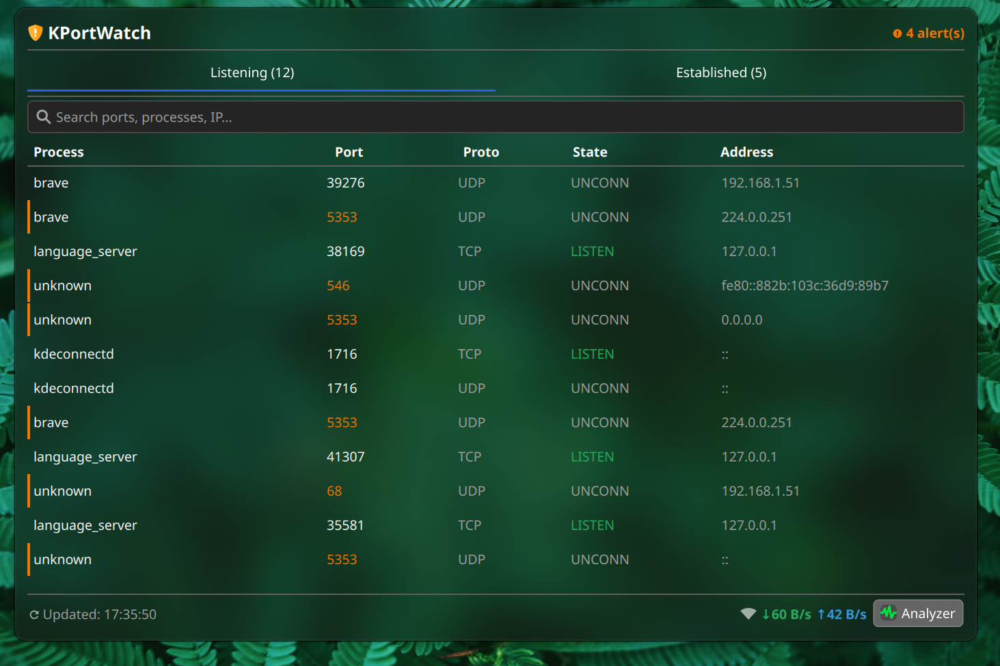
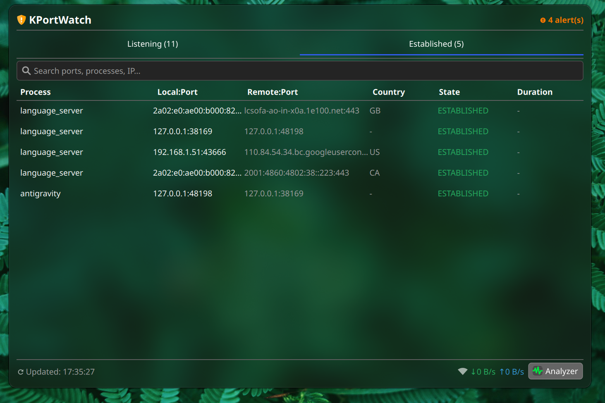
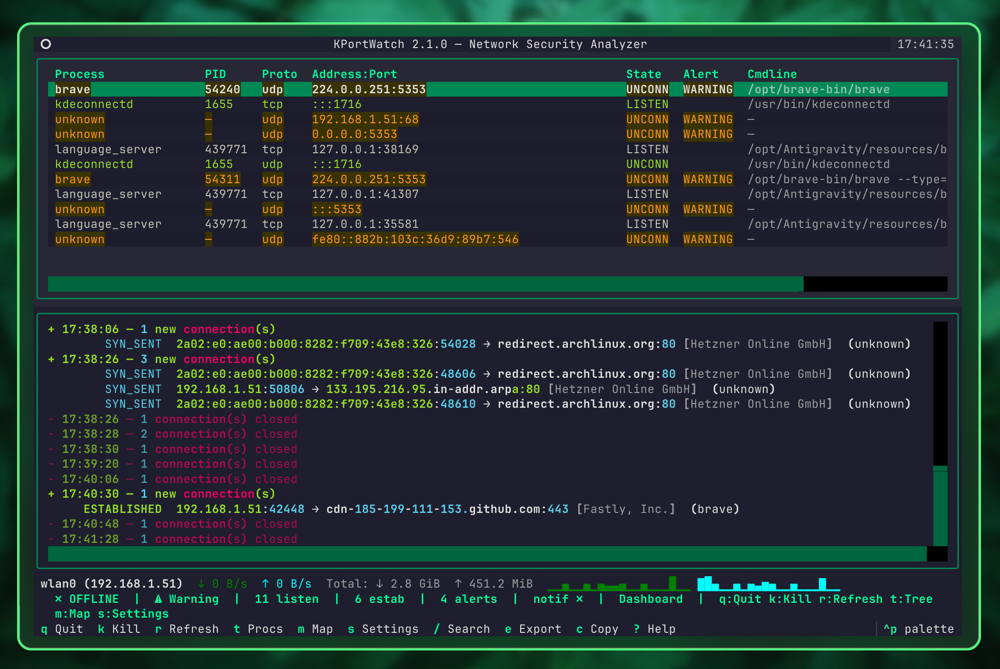
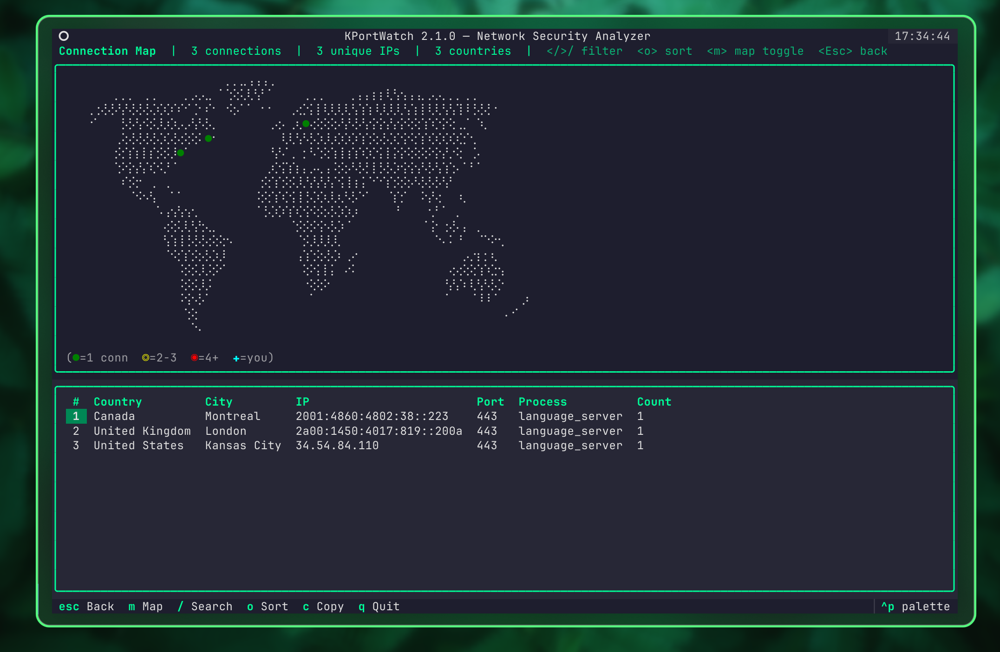
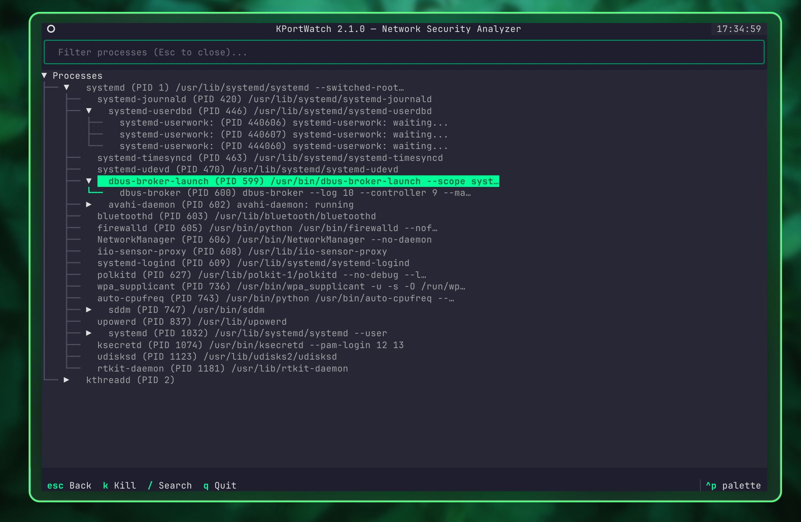

<div align="center">

# 🔒 KPortWatch

**Local Network Security & Port Monitor**

*A hybrid system tray + terminal analyzer for KDE Plasma 6*


</div>

---

## 🖼️ Overview

KPortWatch is a **hybrid architecture** network security monitor designed for Arch Linux (EndeavourOS) running **KDE Plasma 6.6** on **Wayland**. It combines:

| Component | Purpose |
|-----------|---------|
| **Plasma 6 Widget** | Real-time passive alerting in your panel — shield icon + port count badge |
| **Terminal Analyzer (TUI)** | Deep inspection with split-pane layout, connection map, process tree, and keyboard-driven navigation |
| **Backend Daemon** | Lightweight `/proc` parser with alert engine, GeoIP lookup, traffic stats, and baseline learning |

```text
  ┌──────────────────────────────────────────────────┐
  │                   KERNEL (/proc)                  │
  │  /proc/net/tcp  /proc/net/udp  /proc/*/fd        │
  │  /proc/net/dev  /proc/[pid]/stat                  │
  └────────────────────────┬─────────────────────────┘
                           │
            ┌──────────────▼──────────────┐
            │       BACKEND DAEMON        │
            │  • Parse /proc/net/*        │
            │  • Inode → PID mapping      │
            │  • GeoIP + rDNS lookup      │
            │  • Alert engine + baseline  │
            │  • Traffic stats + deltas    │
            │  • Process tree builder     │
            │  • Desktop notifications    │
            │  • Auto-update checker      │
            └──────┬──────────────┬───────┘
                   │(Unix Socket) │(JSON)
     ┌─────────────▼──┐    ┌─────▼──────────────┐
     │   PLASMOID     │    │   TUI (Textual)     │
     │  🔒 Widget     │    │  ┌────────────────┐ │
     │  Real-time     │    │  │  Port Table    │ │
     │  Kill Action   │    │  ├────────────────┤ │
     │  Alert Badge   │    │  │  Connection Log│ │
     └────────────────┘    │  ├────────────────┤ │
                           │  │  Traffic Bar   │ │
                           │  ├────────────────┤ │
                           │  │  Status Bar    │ │
                           │  └────────────────┘ │
                           │  [m] Connection Map │
                           │  [t] Process Tree   │
                           │  [?] Help           │
                           └─────────────────────┘
```

---

## 📸 Screenshots

### KDE Plasma 6 Widget
<p align="center">
  
  
</p>

### Terminal UI (TUI) Analyzer
<p align="center">
  
</p>
<p align="center">
  
  
</p>

---

## ✨ Features

### Widget (Panel)
- 🛡️ Dynamic shield icon — changes color based on threat level (green/yellow/red)
- 🔢 Port count badge showing listening sockets at a glance
- 📋 Popup with listening ports table (Process, PID, Proto, Port, Hostname)
- ⚠️ Alert indicators for suspicious activity
- 💀 Inline **Kill Process** button to terminate suspicious connections instantly
- 🚀 One-click launch of the advanced TUI analyzer
- ⚙️ Configurable polling interval, alert threshold, and safe ports whitelist

### TUI (Terminal Analyzer)
- ⌨️ Keyboard-driven navigation (`q`uit, `k`ill, `r`efresh, `t`ree, `m`ap)
- 📊 Stacked layout — port table (top) + connection stream (bottom) + traffic bar, full-width data display
- 🎨 Color-coded entries — green (safe), yellow (info), red (critical alert)
- 🌍 Reverse DNS (rDNS) resolution for remote IPs
- 🗺️ **Connection Map** — ASCII world map showing outbound connections by country + sortable detail table
- 🌳 **Process Tree** — hierarchical view of all running processes, network-active processes highlighted
- 💀 Kill process with confirmation dialog — SIGTERM (graceful) or SIGKILL (force)
- 📋 Copy any row to clipboard from port table, connection log, or map table
- 🔔 Persistent notification toggle — `n` key to mute/unmute TUI toasts, saved across sessions
- 📤 Export current snapshot to JSON
- 🔄 Auto-refresh every 2 seconds

### Backend Daemon
- 📡 Parses `/proc/net/{tcp,udp}{,6}` directly — zero dependencies, fast
- 🔗 Maps socket inodes to PIDs via `/proc/[pid]/fd/` scanning
- 🧠 Baseline learning — learns your normal ports during first 5 minutes
- 🔔 **Native Desktop Notifications** for Warning and Critical alerts via `notify-send`
- 🌍 **Asynchronous rDNS + GeoIP resolution** with built-in caching
- 🗺️ **GeoIP lookup** via ip-api.com with persistent offline cache (`~/.local/share/kportwatch/geoip-cache.json`)
- 📊 **Network traffic statistics** — per-interface RX/TX rates from `/proc/net/dev`
- 🌳 **Process tree builder** — parent-child relationships with network activity flags
- 🚀 **Unix Domain Socket** streaming via `kportwatch-client` for zero-latency UI updates
- 📈 **History recording** — daily JSON files with summary and alert history
- 🎯 **Port risk scoring** — 0-100 score based on malicious ports, baseline, blacklist
- 🔄 **Auto-update** — periodic GitHub release check with optional auto-apply
- 💓 **Daemon heartbeat** — health monitoring via heartbeat JSON file
- 🚨 Alert rules:
  - Known malicious ports (4444, 5555, 31337, etc.) → **CRITICAL**
  - Unknown privileged ports (<1024) → **WARNING**
  - Burst detection (3+ new ports) → **WARNING**
  - **Custom rules** — user-defined patterns (port, process name, remote IP, protocol)
  - **Whitelist/Blacklist** — per-port and per-IP glob patterns
- ⚡ Adaptive polling — 2s normal, 1s on alert, 10s when idle

---

## 📁 Project Structure

```
kportwatch/
├── backend/                # Daemon and core logic
│   ├── kportwatch_daemon.py     # Main daemon loop
│   ├── daemon_controller.py     # D-Bus controller (start/stop/restart)
│   ├── kportwatchctl.py         # CLI client (socket-based)
│   ├── export.py                # History export CLI
│   ├── alert_engine.py          # Alert evaluation engine
│   ├── baseline.py              # Baseline learning
│   ├── history.py               # History recording (daily JSON)
│   ├── update.py                # Auto-update checker
│   ├── risk_score.py            # Port risk scoring (0-100)
│   ├── writers/                 # Data output (JSON, Unix socket)
│   └── parsers/                 # /proc parsers, GeoIP, rDNS
├── tui/                    # Terminal UI (Textual)
│   ├── kportwatch_tui.py        # TUI app entry point
│   ├── screens/                 # Screens (main, map, tree, settings, help)
│   ├── widgets/                 # Widgets (port table, connection log, traffic bar)
│   ├── themes.py                # 8 built-in themes
│   └── utils/                   # Clipboard, data provider
├── widget/                 # KDE Plasma 6 Widget (QML)
│   └── contents/
│       ├── config/              # Config definitions
│       └── ui/                  # QML UI (main.qml)
├── shared/                 # Shared utilities
│   ├── config.py                # TOML config loader + save
│   ├── constants.py             # Defaults and paths
│   ├── models.py                # Data models (SocketEntry, etc.)
│   ├── network.py               # is_private_ip, CIDR utilities
│   └── fs_utils.py              # Atomic file writes
├── systemd/                # systemd service unit
├── polkit/                 # Polkit policy (kill action)
├── tests/                  # pytest test suite
├── .github/workflows/      # CI (pytest, ruff, bandit, pip-audit)
├── install.sh / uninstall.sh
├── pyproject.toml
└── CHANGELOG.md
```

---

## 🚀 Quick Start

### Prerequisites
- KDE Plasma 6.6+ (Wayland or X11)
- Python 3.11+ (built-in `tomllib` is used)
- `textual` and `rich` Python packages (auto-installed by install script)

### Installation

```bash
# Clone
git clone https://github.com/harunkrl/kportwatch.git
cd kportwatch

# Install (editable mode with dev dependencies)
pip install -e ".[dev]"

# Or install system-wide (widget + systemd service + symlinks)
chmod +x install.sh
./install.sh

# Start the daemon via systemd (auto-starts at boot)
systemctl --user daemon-reload
systemctl --user enable --now kportwatch

# Or run manually in foreground
kportwatch-daemon --foreground

# Add widget to panel
# Right-click panel → Add Widgets → search "KPortWatch"
```

### Uninstallation

```bash
chmod +x uninstall.sh
./uninstall.sh
```

### CLI Commands

```bash
# Start the daemon (foreground, with verbose logging)
kportwatch-daemon --foreground --verbose

# Launch the TUI analyzer
kportwatch

# Stream live data via Unix socket
kportwatch-client

# Export snapshot to JSON
kportwatch-export

# Check for updates
kportwatch-update --check

# Apply available update
kportwatch-update --apply
```

---

## 🎮 TUI Keyboard Shortcuts

| Key | Action | Screen |
|-----|--------|--------|
| `q` | Quit | Global |
| `k` | Kill selected process | Main, Process Tree |
| `r` | Force data refresh | Main |
| `t` | Open process tree view | Main |
| `m` | Open connection map (GeoIP) | Main |
| `n` | Toggle TUI notifications (persisted) | Global |
| `/` | Search / filter | Main, Map, Tree |
| `f` | Toggle filter bar | Main |
| `s` | Cycle sort column | Map |
| `e` | Export snapshot to JSON | Main |
| `c` | Copy row to clipboard | Main, Map |
| `Enter` | Show detail / expand node | Main, Tree |
| `Esc` | Back / close screen | All |

> **Tip:** Hold **Shift** + mouse drag to select text in the terminal (bypasses TUI mouse capture), then copy with `Ctrl+Shift+C` or middle-click.

---

## 📁 Project Structure

```
KPortWatch/
├── shared/
│   ├── constants.py              # Paths, alert levels, malicious ports, version
│   ├── config.py                 # TOML config loader (AppConfig dataclass)
│   ├── fs_utils.py               # Shared filesystem utilities (read_file_safe, atomic_write)
│   └── network.py                # Network utilities (is_private_ip)
├── backend/
│   ├── models.py                 # SocketEntry, Alert, Snapshot, ProcessInfo, InterfaceStats
│   ├── daemon_controller.py      # DaemonController class (lifecycle management)
│   ├── parsers/
│   │   ├── proc_net.py           # /proc/net/tcp,udp parser (IPv4+IPv6)
│   │   ├── inode_map.py          # Socket inode → PID mapping
│   │   ├── rdns.py               # Async rDNS lookup with LRU cache
│   │   ├── geoip.py              # GeoIP lookup (ip-api.com + persistent cache)
│   │   ├── net_dev.py            # /proc/net/dev traffic statistics
│   │   └── process_tree.py       # /proc/[pid]/stat process tree builder
│   ├── collectors/
│   │   └── psutil_collector.py    # psutil-based data collection
│   ├── alert_engine.py           # Baseline learning + alert rules + custom rules
│   ├── risk_score.py             # Port risk scoring (0-100)
│   ├── history.py                # Daily history recording + export
│   ├── export.py                 # CLI export entry point
│   ├── update.py                 # GitHub release checker + auto-update
│   ├── writers/
│   │   ├── json_file.py          # Atomic JSON snapshot writer
│   │   └── unix_socket.py        # Unix domain socket streaming server
│   ├── kportwatch_daemon.py       # Main daemon entry point
│   ├── kportwatchctl.py           # CLI control utility
│   └── kportwatch_client.py       # Unix socket streaming client
├── tui/
│   ├── kportwatch_tui.py          # Textual App entry point
│   ├── themes.py                 # Theme definitions (Cyberpunk, Midnight, Hacker, Daylight)
│   ├── screens/
│   │   ├── main_screen.py        # Split-pane main layout
│   │   ├── connection_map_screen.py  # GeoIP world map + country table
│   │   ├── process_tree_screen.py    # Hierarchical process tree + kill confirmation
│   │   ├── detail_screen.py      # Connection detail modal
│   │   ├── settings_screen.py    # Settings dialog with theme/threshold controls
│   │   ├── kill_confirm.py       # SIGTERM/SIGKILL modal
│   │   └── help_screen.py        # Keyboard shortcuts help
│   ├── widgets/
│   │   ├── port_table.py         # DataTable of listening ports
│   │   ├── connection_log.py     # RichLog of active connections
│   │   ├── traffic_bar.py        # Per-interface RX/TX rate display
│   │   └── status_bar.py         # Bottom status bar
│   ├── data/
│   │   └── provider.py           # JSON reader + process killer
│   ├── utils/
│   │   ├── clipboard.py          # Safe clipboard utility
│   │   └── provider.py           # DataProvider singleton helper
│   └── styles.tcss               # Premium dark security theme
├── widget/
│   ├── metadata.json             # Plasma 6 plugin metadata
│   └── contents/
│       ├── ui/
│       │   ├── main.qml          # Root PlasmoidItem + DataSource
│       │   ├── CompactRepresentation.qml  # Panel icon + badge
│       │   ├── FullRepresentation.qml     # Popup port table
│       │   └── config/
│       │       └── ConfigGeneral.qml      # Settings UI
│       ├── config/
│       │   ├── config.qml
│       │   └── main.xml          # KConfigXT schema
│       └── scripts/
│           └── launch-tui.sh     # Konsole launch wrapper
├── polkit/
│   └── com.kportwatch.helper.policy
├── tests/
│   ├── conftest.py               # Shared fixtures (SocketEntry, Snapshot, etc.)
│   ├── test_geoip.py             # GeoIP module tests (45 tests)
│   ├── test_proc_net.py          # /proc/net parser tests
│   ├── test_alert_engine.py      # Alert engine + custom rules tests
│   ├── test_config.py            # TOML config loader tests
│   ├── test_models.py            # Data model + serialization tests
│   ├── test_daemon.py            # Daemon classify + heartbeat tests
│   ├── test_process_tree.py      # Process tree builder tests
│   ├── test_net_dev.py           # Traffic statistics tests
│   ├── test_rdns.py              # rDNS cache + lookup tests
│   ├── test_risk_score.py        # Port risk scoring tests
│   ├── test_history.py           # History recording tests
│   ├── test_update.py            # Auto-update mechanism tests
│   ├── test_unix_socket.py       # Unix socket server tests
│   ├── test_provider.py          # TUI data provider tests
│   └── test_json_file.py         # Atomic JSON writer tests
├── install.sh
├── uninstall.sh
└── README.md
```

---

## ⚙️ Configuration

### TOML Config File

All backend settings are configurable via `~/.config/kportwatch/config.toml`.
Generate an example config:

```bash
python -c "from shared.config import generate_example_config; generate_example_config('/tmp/kportwatch-example.toml')"
cat /tmp/kportwatch-example.toml
```

#### Key Sections

| Section | Key Settings |
|---------|-------------|
| `[polling]` | `interval`, `alert_interval`, `idle_interval`, `idle_threshold_secs` |
| `[alerts]` | `baseline_duration`, `burst_threshold`, `malicious_ports`, `known_safe_ports` |
| `[dns]` | `cache_size`, `max_pending` |
| `[geoip]` | `enabled`, `api_url`, `cache_file`, `cache_max_entries`, `cache_ttl_days`, `batch_size`, `timeout` |
| `[notifications]` | `enabled`, `min_level`, `alert_ttl`, `rate_limit`, `rate_window` |
| `[update]` | `enabled`, `check_interval`, `auto_apply` |
| `[tui]` | `notifications_enabled` — persist TUI notification toggle |
| `[whitelist]` | `ports` — never alert on these |
| `[blacklist]` | `ports`, `ips` — always CRITICAL |
| `[[custom_rules]]` | `match`, `level`, `message` — user-defined alert rules |

#### Example: Custom Alert Rule

```toml
[[custom_rules]]
match = { process_name = "ncat*" }
level = "CRITICAL"
message = "Ncat detected — possible reverse shell"
```

#### Example: GeoIP Configuration

```toml
[geoip]
enabled = true
cache_max_entries = 4096
cache_ttl_days = 7
batch_size = 10
timeout = 5.0
```

### Widget Settings

Accessible via **right-click → Configure**:

| Setting | Default | Description |
|---------|---------|-------------|
| `pollInterval` | 2 | Seconds between data refreshes |
| `alertThreshold` | WARNING | Minimum alert level to display |
| `knownSafePorts` | 22,80,443,631,5353 | Comma-separated safe port list |
| `tuiCommand` | `kportwatch-tui` | TUI launch command |
| `daemonEnabled` | true | Auto-start daemon |

### Auto-Start with systemd

```bash
systemctl --user daemon-reload
systemctl --user enable --now kportwatch

# Check status
systemctl --user status kportwatch

# View logs
journalctl --user -u kportwatch -f
```

---

## 🔐 Security Model

| Aspect | Details |
|--------|---------|
| **Root required?** | ❌ No — `/proc/net/tcp` is world-readable |
| **PID resolution** | Works for user-owned processes without privileges |
| **System processes** | Shown as "unknown (system)" — root-owned `/proc/*/fd/` requires privilege escalation |
| **Optional helper** | Polkit policy included for full PID visibility |
| **Kill operations** | Only works for same-user processes by default |
| **Data exposure** | JSON written to `$XDG_RUNTIME_DIR/` — contains port/PID info only (no secrets) |
| **Command injection** | Widget uses hardcoded paths — no user input in shell commands |
| **GeoIP privacy** | Only public remote IPs are looked up; results cached locally; no tracking |

### Privilege Escalation (Optional)

For full system-wide PID visibility, choose one:

```bash
# Option A: sudoers rule
echo "YOUR_USER ALL=(root) NOPASSWD: /usr/bin/ss -tulnp" | sudo tee /etc/sudoers.d/kportwatch

# Option B: file capabilities on a helper binary
sudo setcap cap_net_admin+ep /usr/local/bin/kportwatch-helper

# Option C: Polkit policy (included)
sudo cp polkit/com.kportwatch.helper.policy /usr/share/polkit-1/actions/
```

---

## 🏗️ Architecture Decisions

| Decision | Rationale |
|----------|-----------|
| Parse `/proc/net/` directly instead of `ss` | Zero dependencies, world-readable, ~2ms per parse |
| Inode → PID via `/proc/*/fd/` scanning | No root needed for user processes, ~45ms per scan |
| Atomic JSON file (write→rename) | Prevents partial reads, works across all consumers |
| Textual for TUI | Modern Python TUI framework, Wayland-native, rich styling |
| `Plasma5Support.DataSource` for widget | Standard Plasma 6 pattern for polling external data |
| Adaptive polling intervals | Minimizes CPU when idle, maximizes responsiveness on alerts |
| Stdlib-only daemon | No external dependencies for the core daemon process |
| TOML config file | Human-readable, type-safe, standard Python (tomllib) |
| GeoIP with persistent cache | Offline capability, respects API rate limits (45 req/min) |

---

## ⚠️ Known Limitations

- Non-root users can only resolve PIDs for their own processes
- UDP "connections" are stateless — shown as UNCONN in the table
- `TIME_WAIT`, `CLOSE_WAIT` etc. are grouped under "established" (active)
- GeoIP accuracy depends on ip-api.com database — some IPs may return approximate locations
- ASCII world map resolution is coarse (80×20) — small countries may overlap
- The `executable` DataEngine is deprecated in future Plasma versions (6.7+)

---

## 🛠️ Tech Stack

| Component | Technology |
|-----------|-----------|
| Widget | QML, Kirigami, Plasma 6 Plasma5Support |
| TUI | Python Textual, Rich |
| Backend | Python 3.11+ (requires psutil >=5.9) |
| Config | TOML (Python 3.11+ tomllib) |
| IPC | JSON file via atomic rename + Unix domain socket |
| GeoIP | ip-api.com (free tier) + persistent JSON cache |
| Desktop | KDE Plasma 6.6, Qt 6, Wayland |

---

## 📄 License

This project is licensed under the **MIT** License.

---

<div align="center">

**Built with ❤️ for KDE Plasma 6 on Arch Linux**

</div>
